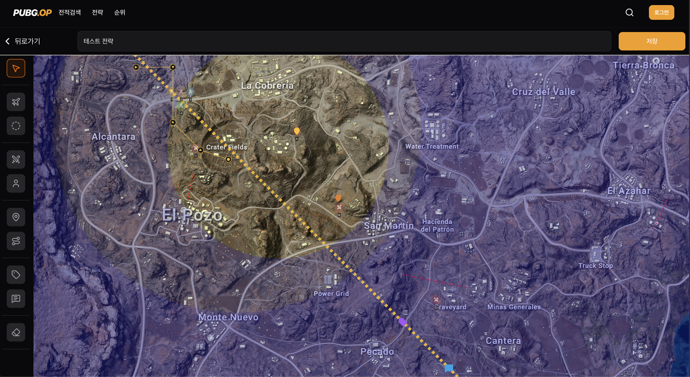
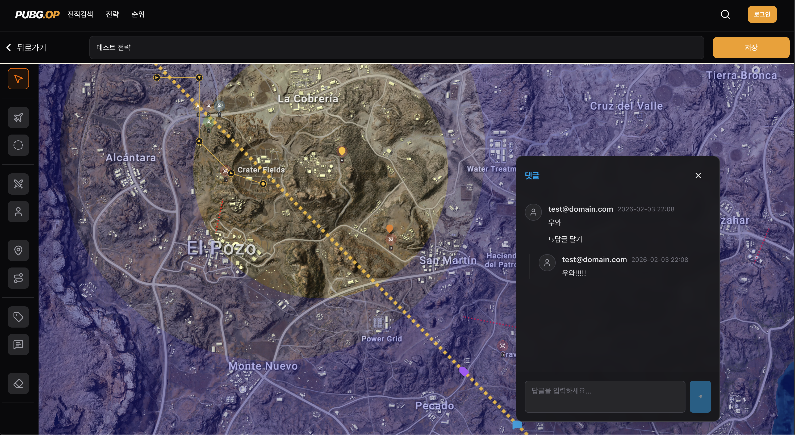

# 기본 정보

- `Node`: v25.2.1 (Reelase. 2025.11.16)
- `Next`: v16 (Release. 2025.10.21)
- `Yarn`: v4.12.0 (Release. 2025.11.23)




> 문서
> [Technical specifications](docs/Technical_specifications.md)

# 아키텍처

- Hexagonal Architecture

> 문서
> [Hexagonal Architecture](docs/Architecture.md)

# 서비스 흐름

### A. 데이터 조회 흐름

사용자가 처음 페이지에 진입하여 데이터를 보는 과정입니다.

1. 페이지 진입: 사용자가 브라우저 주소창에 URL을 입력하여 페이지를 요청합니다.
2. 서버 컴포넌트 실행: Next.js 서버에서 페이지 파일이 실행됩니다.
3. 데이터 프리페칭 요청: 서버 컴포넌트가 Server Action을 직접 함수처럼 호출하여 데이터 조회를 요청합니다.
4. 유스케이스 실행: Server Action이 UseCase의 실행 메서드를 호출합니다.
5. 레포지토리 호출: UseCase가 데이터 확보를 위해 Repository Interface를 호출합니다.
6. 백엔드 API 요청: 주입된 Repository Impl이 HTTP 통신을 이용해 외부 백엔드 서버로 요청을 보냅니다.
7. 데이터 반환 및 가공: 백엔드 응답이 Repository → UseCase → Server Action을 거쳐 서버 컴포넌트로 돌아옵니다.
8. 직렬화 및 전송: 서버 컴포넌트가 가져온 데이터를 직렬화하여 HTML과 함께 브라우저로 전송합니다.
9. 하이드레이션: 브라우저에서 Client Component가 실행되고, 훅이 실행됩니다. 이때 네트워크 요청 없이 전달받은 초기 데이터를 캐시에서 로드하여 화면을 그립니다.

---

### B. 데이터 조작 흐름

사용자가 데이터를 변경하는 과정입니다.

1. 사용자 이벤트: 사용자가 폼을 입력하고 등록 버튼을 클릭합니다.
2. 뮤테이션 실행: Client Component가 훅의 데이터 변경 함수를 호출합니다.
3. 서버 액션 호출: React Query가 Next.js의 Server Action을 비동기 네트워크 요청으로 호출합니다.
4. 비즈니스 로직 수행: Server Action → UseCase → Repository 순으로 호출되며, 필요한 유효성 검사 및 비즈니스 로직을 수행합니다.
5. 백엔드 데이터 변경: Repository Impl이 외부 백엔드 서버로 데이터 변경 요청을 보냅니다.
6. 응답 반환: 백엔드 처리 결과가 역순으로 클라이언트에게 전달됩니다.

---

### C. 데이터 동기화 흐름

데이터 조작 성공 후, 최신 데이터를 화면에 반영하는 과정입니다.

1. 캐시 무효화: 데이터 변경 성공 콜백에서 기존 쿼리 키를 무효화합니다.
2. 상태 변경: 해당 쿼리 키를 가진 캐시 데이터가 상한 상태로 표시됩니다.
3. 재조회 트리거: 화면에 해당 데이터를 보여주는 컴포넌트가 있다면, 상한 상태를 감지하고 데이터 재요청을 시작합니다.
4. 최신 데이터 조회: Client Component → Server Action → UseCase → Backend API 순으로 최신 데이터 조회 흐름이 다시 실행됩니다.
5. UI 업데이트: 받아온 최신 데이터로 캐시가 갱신되고, 이를 구독하던 컴포넌트가 다시 그려져 변경된 내용을 사용자에게 보여줍니다.

> 이미지
> [Flow](docs/Flow.md)

# 디자인 패턴

- Domain Driven Development

> 문서
> [Design Pattern](docs/Design_pattern.md)

# 요구사항

> 문서
> [Requests](docs/Requests.md)

# 설계 문서

> 문서
> [Domain Design](docs/Domain_Design.md)

# 폴더 구조(2026-02-19)

> [Folder Structure](docs/Folder_Structure_20260219.md)

# 테스트 커버리지 (2026-02-19)

> 테스트 커버리지 100%를 목표로 하기보단, 코어를 테스트하는데 집중합니다.

Statements   : 94.88% ( 1779/1875 )<br>
Branches     : 77.5% ( 348/449 )<br>
Functions    : 87.81% ( 519/591 )<br>
Lines        : 94.58% ( 1661/1756 )<br>
---

# 실행방법

1. Node 25.2.1 버전 설치
2. `npm install -g yarn`
3. 폴더에 들어와서 `yarn install`
4. `yarn dev` 로 개발서버 실행

---

# 환경변수

## 구글 관련

```markdown
GOOGLE_CLIENT_ID
GOOGLE_CLIENT_SECRET
GOOGLE_REDIRECT_URI
```

---
빌드시 위 환경 변수를 추가해주세요.