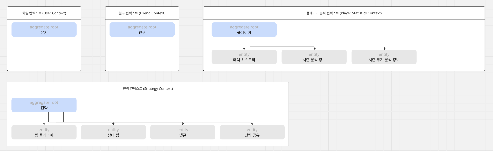

# Bounded Context & Aggregate Root / Domain Model & Function

Domain Model

<aside>
🚧

# Shared Kernel

### 〒 Value Object

> 불변 객체, 동등성 비교로 관리
> 

<aside>
➡️

UserId 

---

| 필드명 | 타입 | 설명 |
| --- | --- | --- |
| id | string | 유저 고유 식별자 |

---

1. 유저 아이디가 같은지 비교할 수 있는 함수를 제공한다.
2. 원시 값 반환에 대한 함수를 제공한다.
</aside>

<aside>
➡️

Email

---

`email: string`

---

1. `@`, `.` 포함 여부를 확인하여 이메일 형식을 검증한다.
</aside>

### 📑 Enum

<aside>
➡️

Map

> PUBG 맵
> 

---

- Erangel (에란겔)
- Miramar (미라마)
- Vikendi (비켄디)
- Sanhok (사녹)
- Karakin (카라킨)
- Taego (태이고)
- Rondo (론도)
</aside>

</aside>

<aside>
🚧

# **User Context**

## 📌 책임 (Responsibility)

1. 회원 관리를 진행한다.
    1. 비밀번호 변경 따위가 존재할 수 있다.
2. 인증을 담당한다.

## 🔠 유비쿼터스 언어 (Ubiquitous Language)

| 용어 | 설명 |
| --- | --- |
| 유저 (User) | 시스템 사용자를 의미한다. |
| 이메일 (Email) | 사용자의 이메일 주소를 의미한다. |
| 패스워드 (Password) | 암호화된 비밀번호를 의미한다. |
| 마지막 수정 일자(UpdateAt) | 유저 정보가 마지막으로 수정된 일자를 의미한다. |

## 🚴‍♂️ 주요 Use Case (Use Cases)

1. SSO를 통한 회원가입 (`RegisterWithGoogleSSO`)
2. 일반 회원가입 (`RegisterWithEmail`)
3. SSO 로그인 (`LoginWithEmail` )
4. 일반 로그인 (`LoginWithGoogleSSO`)
5. 로그아웃 (`Logout`)
6. 회원탈퇴 (`WithdrawUser`)
7. 비밀번호 변경 (`ChangePassword`)
8. 내 정보 불러오기 (`GetCurrentUser`)
9. 이메일이 이미 사용중인지 체크하기 (`isDuplicateEmail`)
10. 비밀번호를 이전에 사용했는지 체크하기 (`isReusedPassword`)

## 👍 루트 애그리거트 (Aggregate Root) - **User**

| 필드명 | 타입 | 설명 |
| --- | --- | --- |
| id | UserId (ValueObject) | 유저 고유 식별자 |
| email | Email (ValueObject) | 유저 이메일 |
| password | Password? (ValueObject) | 유저 비밀번호 
| 회원 로그인 후 객체에서는 Null을 허용한다.
| SSO의 경우 회원가입시에도 비밀번호가 없으므로 Null을 허용한다. |

### ⚙️ Domain Entity

### 〒 Value Object

> 불변 객체, 동등성 비교로 관리
> 

<aside>
➡️

Password

---

`password: string`

---

1. 비밀번호 유효성 검증을 진행한다.
    1. 비밀번호는 최소 8자 이상
    2. 대문자, 소문자, 숫자, 특수문자 포함 여부 확인
</aside>

### ⛓️ Service

> 도메인 로직이 개별 Entity에 속하지 않을 때 사용
> 

<aside>
➡️

PasswordValidator

---

1. 비밀번호가 이메일 문자열을 포함하는지 검증한다. (비밀번호 변경, 회원가입시 사용)
    
    > `Email`, `Password` 만 있으면 되어서 순수 도메인 로직(Entity)의 책임으로 돌릴 수 있으나, 비밀번호 정책이 User Entity와 강결합을 원하지 않아 Service로 분리한다.
    > 
</aside>

### 📑 Enum

</aside>

<aside>
🚧

# Friend Context

## 📌 책임 (Responsibility)

1. 사용자 간 친구 관계를 관리한다.
    - 친구 추가, 친구 삭제, 친구 요청 수락 및 거절
2. 친구 목록을 조회한다.

## 🔠 유비쿼터스 언어 (Ubiquitous Language)

| 용어 | 설명 |
| --- | --- |
| Friendship | 두 사용자 간의 친구 관계 |
| FriendshipStatus | PENDING(대기), ACCEPTED(수락), REJECTED(거절) |
| Requester | 친구 요청을 보낸 사용자 |
| Accepter | 친구 요청을 받은 사용자 |

## 🚴‍♂️ 주요 Use Case (Use Cases)

1. 친구 목록 조회 (`GetFriendshipList`)
2. 받은 친구 요청 조회 (`GetReceiveFriendshipRequests`)
3. 보낸 친구 요청 조회 (`GetSentFriendshipRequests`)
4. 친구 추가 (`RequestFriendship`)
5. 친구 삭제 (`DeleteFriendship`)
6. 보낸 친구 요청 취소 (`CancelFriendRequest`)
7. 친구 요청 수락 (`AcceptFriendRequest`)
8. 친구 요청 거절 (`RejectFriendRequest`)

## 👍 루트 애그리거트 (Aggregate Root) - Friend

| 필드명 | 타입 | 설명 |
| --- | --- | --- |
| id | FriendshipId? | 친구 관계 고유 식별자
| 최초 생성시에는 Null을 허용한다. |
| requesterId | UserId | 친구 관계 요청자 유저 고유 식별자 |
| accepterId | UserId | 친구 관계 요청을 받은 유저 고유 식별자 |
| status | FriendshipStatus | 친구 관계 상태 |
| requesterEmail | string | 요청자 이메일 |
| accepterEmail | string | 요청을 받은 자 이메일 |
| requestedAt | Date | 요청 일시 |
| respondedAt | Date? | 응답 일시 |

### ⚙️ Domain Entity

### 〒 Value Object

> 불변 객체, 동등성 비교로 관리
> 

<aside>
➡️

FriendshipId

---

| 필드명 | 타입 | 설명 |
| --- | --- | --- |
| id | string | 친구 관계 고유 식별자 |

---

1. 원시 값 반환에 대한 함수를 제공한다.
2. 백엔드에서 부터 받은 ID값을 string → FriendshipId로 변환한다.
</aside>

### ⛓️ Service

### 📑 Enum

<aside>
➡️

FriendshipStatus

> 친구 관계에 대한 Enum Class.
> 

---

- PENDING(대기)
- ACCEPTED(수락)
- REJECTED(거절)
</aside>

</aside>

<aside>
🚧

# Strategy

## 📌 책임 (Responsibility)

1. 전략을 관리한다.
    1. 전략 생성, 수정, 삭제를 관리한다.
    2. 전략 내 코멘트를 관리한다.
2. 전략 공유 여부를 관리한다.
    1. 전략 공유하기, 공유해제하기를 관리한다.

## 🔠 유비쿼터스 언어 (Ubiquitous Language)

| 용어 | 설명 |
| --- | --- |
| Strategy | 전략 |
| StrategyShare | 전략 공유 |
| StrategySharePermission | 전략 공유시 부여된 권한 |
| Comment | 전략에 달린 댓글 |
| Map | 맵 종류 |
| Markers | 전략에 생성된 마커 |
| Waypoints | 전략에 생성된 웨이포인트 |
| TeamPlayers | 전략에 참여한 팀 플레이어 (최대 4명) |
| EnemyTeams | 전략에 생성된 상대 팀 (최대 4명) |
| Circle | 자기장 |
| Author | 댓글 작성자 |

## 🚴‍♂️ 주요 Use Case (Use Cases)

1. 전략 목록 조회 (`GetStrategyList`)
2. 내가 만든 전략만 조회 (`GetMyStrategies`)
3. 공유 받은 전략만 조회 (`GetSharedStrategies`)
4. 전략 생성 (`CreateStrategy`)
5. 전략 삭제 (`DeleteStrategy`)
6. 전략 수정 (`UpdateStrategy`)
7. 전략 수정 시작하기 (`StartEditing`)
8. 전략 수정 종료하기 (`EndEditing`)
9. 전략 공유 (`CreateStrategyShare`)
10. 전략 공유 해제 (`RevokeStrategyShare`)
11. 전략 공유 정보 조회 (`GetSharedStrategyUsers`)
12. 전략 구성 요소 생성
    1. 자기장 생성 (`CreateCircle`)
    2. 자기장 수정 (`UpdateCircle`)
    3. 자기장 삭제 (`DeleteCircle`)
    4. 팀 플레이어 추가 (`AddTeamPlayer`)
    5. 팀 플레이어 이동 (`MoveTeamPlayer`)
    6. 팀 플레이어 삭제 (`DeleteTeamPlayer`)
    7. 팀 플레이어 구성 요소 생성
        1. 마커 추가 (`AddMarker`)
        2. 마커 삭제 (`DeleteMarker`)
        3. 마커 위치 변경 (`MoveMarker`)
        4. 웨이포인트 추가 (`AddWaypoint`)
        5. 웨이포인트 삭제 (`DeleteWaypoint`)
    8. 상대 팀 추가 (`AddEnemyTeam`)
    9. 상대 팀 이동 (`MoveEnemyTeam`)
    10. 상대 팀 삭제 (`DeleteEnemyTeam`)
13. 댓글 작성하기 (`CreateComment`)
14. 댓글 삭제하기 (`DeleteComment`)
15. 댓글 수정하기 (`UpdateComment`)
16. 댓글 조회하기 (`GetComments`)

## 👍 루트 애그리거트 (Aggregate Root) - Strategy

| 필드명 | 타입 | 설명 |
| --- | --- | --- |
| id | StrategyId? | 전략 고유 식별자
| 최초 생성시에는 Null을 허용한다. |
| ownerId | UserId | 전략 생성 유저 고유 식별자 |
| title | string | 전략 제목 |
| map | Map | 맵 종류 |
| teamPlayers | List<TeamPlayer> | 전략에 속한 팀 플레이어
| 최대 4명이 생성될 수 있다. |
| enemyTeams | List<EnemyTeam> | 전략에 속한 상대 팀
| 최대 10개의 팀이 생성될 수 있다. |
| circles | List<Circle> | 전략의 자기장
| 최대 8개까지 생성될 수 있다. |
| airplanePath | AirplanePath | 비행기 동선 좌표 |
| shares | List<StrategyShare> | 공유된 전략 정보 |
| comments | List<Comment> | 댓글 |
| isEditing | boolean | 전략 편집 여부 → 애매함. 더 고민 필요 |
| createdAt | Date | 생성일시 |
| updatedAt | Date | 수정일시 |

### ⚙️ Domain Entity

<aside>
📖

TeamPlayer

---

**[📌 책임 (Responsibility)]**

1. 전략 내 팀 플레이어를 관리한다.
    1. 플레이어의 마커, 이동경로, 위치를 관리한다.

---

| 필드명 | 타입 | 설명 |
| --- | --- | --- |
| id | TeamPlayerId? | 팀 플레이어 고유 식별자
| 최초 생성시에는 Null을 허용한다. |
| marker | Marker | 팀 플레이어의 마커 |
| waypoints | List<Waypoint> | 팀 플레이어의 웨이포인트 |
| position | Position | 팀 플레이어 위치 |
| createdAt | Date | 생성일시 |
| updatedAt | Date | 수정일시 |

---

**[주요 도메인 로직]**

1. 마커 생성, 삭제
2. 웨이포인트 생성, 삭제
3. 위치 변경
</aside>

<aside>
📖

EnemyTeam

---

**[📌 책임 (Responsibility)]**

1. 전략 내 상대 팀을 관리한다.
    1. 상대 팀의 위치, 레이블을 관리한다.

---

| 필드명 | 타입 | 설명 |
| --- | --- | --- |
| id | EnemyTeamId? | 상대 팀 플레이어 고유 식별자
| 최초 생성시에는 Null을 허용한다. |
| label | TeamLabel | 팀 레이블 (팀명) |
| position | Position | 팀 플레이어 위치 |
| createdAt | Date | 생성일시 |
| updatedAt | Date | 수정일시 |

---

**[주요 도메인 로직]**

1. 팀 레이블 변경
2. 위치 변경
3. 상대 팀 삭제
</aside>

<aside>
📖

StrategyShare

---

**[📌 책임 (Responsibility)]**

1. 전략에 대한 권한, 공유 여부를 관리한다.

---

| 필드명 | 타입 | 설명 |
| --- | --- | --- |
| id | StrategyShareId? | 전략 공유 고유 식별자
| 최초 생성시에는 Null을 허용한다. |
| strategyId | StrategyId | 전략 고유 식별자 |
| sharedWithUserId | UserId | 전략을 공유 받을 유저 고유 식별자 |
| sharedWithEmail | string | 전략을 공유 받을 유저 고유 이메일 |
| permission | SharePermission | 공유 받을 유저의 권한 |
| sharedAt | Date | 공유 일시 |

---

**[주요 도메인 로직]**

1. 전략 공유하기
2. 권한 변경
3. 전략 공유해제
</aside>

<aside>
📖

Comment

---

**[📌 책임 (Responsibility)]**

1. 전략에 대한 댓글을 관리한다.

---

| 필드명 | 타입 | 설명 |
| --- | --- | --- |
| id | CommentId? | 댓글 고유 식별자
| 최초 생성시에는 Null을 허용한다. |
| strategyId | StrategyId | 전략 고유 식별자 |
| position | Position | 맵 위 댓글 위치 |
| authorId | UserId | 댓글 작성 유저 고유 식별자 |
| authorEmail | string | 댓글 작성 유저 이메일 |
| content | string | 내용 |
| parentCommentId | CommentId? | 부모 댓글 고유 식별자 |
| createdAt | Date | 생성일시 |
| updatedAt | Date | 수정일시 |

---

**[주요 도메인 로직]**

1. 댓글 생성
2. 댓글 삭제
3. 댓글 수정
4. 답변인지 여부 체크
5. 탑 레벨인지 여부 체크 (부모 댓글인지)
</aside>

### 〒 Value Object

> 불변 객체, 동등성 비교로 관리
> 

<aside>
➡️

StrategyId

---

| 필드명 | 타입 | 설명 |
| --- | --- | --- |
| id | string | 전략 고유 식별자 |

---

전략에 대한 고유 식별자를 관리한다.

원시값을 내뱉거나, UUID 형식인지 등에 대한 검사가 진행되고 string을 받아 StrategyId로 돌려주는 함수도 있다.

</aside>

<aside>
➡️

TeamPlayerId

---

| 필드명 | 타입 | 설명 |
| --- | --- | --- |
| id | string | 팀 플레이어 고유 식별자 |

---

팀 플레이어에 대한 고유 식별자를 관리한다.

원시값을 내뱉거나, UUID 형식인지 등에 대한 검사가 진행되고 string을 받아 TeamPlayerId로 돌려주는 함수도 있다.

</aside>

<aside>
➡️

EnemyTeamId

---

| 필드명 | 타입 | 설명 |
| --- | --- | --- |
| id | string | 적 팀 고유 식별자 |

---

팀 플레이어에 대한 고유 식별자를 관리한다.

원시값을 내뱉거나, UUID 형식인지 등에 대한 검사가 진행되고 string을 받아 EnemyTeamId로 돌려주는 함수도 있다.

</aside>

<aside>
➡️

StrategyShareId

---

| 필드명 | 타입 | 설명 |
| --- | --- | --- |
| id | string | 전략 공유 고유 식별자 |

---

팀 플레이어에 대한 고유 식별자를 관리한다.

원시값을 내뱉거나, UUID 형식인지 등에 대한 검사가 진행되고 string을 받아 StrategyShareId로 돌려주는 함수도 있다.

</aside>

<aside>
➡️

Circle

---

| 필드명 | 타입 | 설명 |
| --- | --- | --- |
| centerPosition | Position | 가운데 위치값 |
| radius | number | 반지름 |
| phase | number | 페이즈 |

---

center x,y 값 / 크기 / 페이즈를 관리한다.

</aside>

<aside>
➡️

Waypoint

---

| 필드명 | 타입 | 설명 |
| --- | --- | --- |
| position | Position | 위치값 |

---

x, y 값을 포함하여 어디로 이동하는지 관리한다.

중복된 위치로의 이동인지를 검증한다.

</aside>

<aside>
➡️

Marker

---

| 필드명 | 타입 | 설명 |
| --- | --- | --- |
| position | Position | 위치값 |

---

x, y 값을 포함하여 마커를 관리한다.

</aside>

<aside>
➡️

TeamLabel

---

| 필드명 | 타입 | 설명 |
| --- | --- | --- |
| label | string | 레이블명 |

---

팀 레이블명을 관리한다.

한 글자 이상 제약조건, A - Z까지만 가능한 제약 조건을 관리한다.

</aside>

<aside>
➡️

Position

---

| 필드명 | 타입 | 설명 |
| --- | --- | --- |
| x | number | x좌표 값 |
| y | number | y좌표 값 |

---

x, y 값을 관리한다.

</aside>

<aside>
➡️

AirplanePath

---

| 필드명 | 타입 | 설명 |
| --- | --- | --- |
| position | Position | 위치값 |

---

x, y 값을 관리한다.

</aside>

### ⛓️ Service

> 도메인 로직이 개별 Entity에 속하지 않을 때 사용
> 

<aside>
➡️

Service Name

---

역할

</aside>

### 📑 Enum

<aside>
➡️

PlayerColor

> 팀 플레이어 색상
> 

---

- RED
- ORANGE
- YELLOW
- GREEN
</aside>

<aside>
➡️

SharePermission

> 팀 플레이어 색상
> 

---

- READ_ONLY
- EDIT
</aside>

</aside>

<aside>
🚧

# Player Statistics

## 📌 책임 (Responsibility)

1. 플레이어 전적 조회
2. 매치 데이터, 시즌 통계, 무기 통계 조회
3. 전적 데이터 갱신 정책 관리
    - 갱신 제한: 30분에 1회
    - 7일간 갱신 되지 않았다면 자동 갱신 처리 하도록 API 요청
4. 플랫폼별(Steam, Kakao) 플레이어 프로필 관리

## 🔠 유비쿼터스 언어 (Ubiquitous Language)

| 용어 | 설명 |
| --- | --- |
| Player | PUBG 게임 내 사용자 |
| Platform | PUBG 게임 플랫폼 (Steam, Kakao) |
| Profile | 특정 플랫폼의 플레이어 정보 |
| Match | 한 게임의 플레이 기록 (순위, 킬, 데미지 등 포함) |
| Season | PUBG의 특정 기간 단위 (시즌별로 통계, 전적이 분리됨) |
| GameMode | Solo, Duo, Squad, Rank/일반 등 모드별 통계 분리 |
| Weapon | 게임 내 무기(무기별 사용 통계) |
| Map | 맵 종류 (Erangel, Miramar 등) |
| Tier | 랭크 등급 (Bronze, Silver, Gold 등) |
| RankPoint | 랭크 포인트 |
| SubTier | 랭크 등급 수치 (1, 2, 3, 4) |

## 🚴‍♂️ 주요 Use Case (Use Cases)

1. 플레이어 검색 (`SearchPlayer`)
2. 매치 히스토리 가져오기 (`FetchMatchHistory`)
3. 시즌 통계 가져오기 (`FetchSeasonStats`)
4. 시즌 무기 통계 가져오기 (`FetchSeasonWeaponStats`)
5. 매치 상세 내역 가져오기 (`GetMatchDetail`)
6. 모든 통계 업데이트 (`RefreshAllStats`)
7. 업데이트 가능 여부 체크 (`CheckRefreshAvailability`)
8. 시즌 데이터 가져오기 (`GetSeasonList`)

## 👍 루트 애그리거트 (Aggregate Root) - Player

| 필드명 | 타입 | 설명 |
| --- | --- | --- |
| id | PlayerId | 플레이어 고유 식별자 |
| platform | Platform | 플레이어 플랫폼 |
| nickname | string | 플레이어 닉네임 |
| matchHistories | List<MatchHistory> | 특정 시즌 내 플레이어 매치 히스토리 |
| seasonStats | List<SeasonStat> | 특정 시즌 내 게임모드별 플레이어 분석 데이터 |
| weaponStats | WeaponStat | 특정 시즌 내 플레이어 무기 분석 데이터 |
| lastUpdatedAt | Date | 마지막 전적 갱신 일시 |

### ⚙️ Domain Entity

<aside>
📖

MatchHistory

---

**[📌 책임 (Responsibility)]**

1. 한 게임의 상세 플레이 기록 관리
2. 팀 정보, 순위, 전투 기록 포함하여 기록을 관리

---

| 필드명 | 타입 | 설명 |
| --- | --- | --- |
| id | MatchId | 매치 고유 식별자 |
| gameMode | GameMode | 게임 모드 (솔로, 듀오, 스쿼드) |
| map | Map | 맵 종류 |
| rank | number | 매치 순위 |
| teamLeaderboards | List<Leaderboard> | 전적 조회된 플레이어와, 플레이어 팀 내 멤버들의 리더보드 |

---

**[주요 도메인 로직]**

1. 팀에서 몇인분 했는지 계산 → 상세 도메인 로직 구상 필요
</aside>

<aside>
📖

SeasonStat

---

**[📌 책임 (Responsibility)]**

1. 한 시즌 내 플레이어의 종합 정보 관리

---

| 필드명 | 타입 | 설명 |
| --- | --- | --- |
| id | SeasonStatId | 시즌 종합 정보 고유 식별자 |
| playerId | PlayerId | 플레이어 고유 식별자 |
| season | string | 시즌 정보 |
| gameMode | GameMode | 게임 모드 |
| matchCount | number | 시즌 플레이 수 |
| longestKill | number | 시즌 내 최장거리 킬 |
| headshotKills | number | 시즌 내 헤드샷 킬 수 |
| averageDamage | number | 시즌 내 평균 데미지 |
| maxDamage | number | 시즌 내 최고 데미지 |
| averageRank | number | 시즌 내 평균 순위 |
| averageSurvivalTimeSecond | number | 시즌 내 평균 생존 시간 |
| top10Rate | number | 시즌 내 탑10 진입 비율 |
| winRate | number | 승리 비율(치킨) |
| maxKillsPerMatch | number | 한 경기당 최고 킬 수 |
| maxKnockDownsPerMatch | number | 한 경기당 최고 다운 시킨 수 |
| currentTier | string | 현재 티어
| 예: 플래티넘 |
| currentSubTier | number | 현재 티어 수치
| 예: 4 |
| currentRankPoint | number | 현재 랭크 포인트 |
| seasonMaxTier | string | 시즌 최고 티어
| 예: 플래티넘 |
| seasonMaxSubTier | number | 시즌 최고 티어 수치
| 예: 3 |
| seasonMaxRankPoint | number | 시즌 최고 랭크 포인트 |

---

</aside>

<aside>
📖

SeasonWeaponStat

---

**[📌 책임 (Responsibility)]**

1. 한 시즌 내 플레이어의 무기 사용 정보 관리

---

| 필드명 | 타입 | 설명 |
| --- | --- | --- |
| id | SeasonWeaponStatId | 시즌 무기 사용 정보 고유 식별자 |
| playerId | PlayerId | 플레이어 고유 식별자 |
| season | string | 시즌 정보 |
| weaponId | WeaponId | 무기 식별자 |
| weaponName | string | 무기명 |
| damage | number | 무기로 입힌 데미지 |
| averageDamage | number | 무기로 입힌 평균 데미지 |
| headshotKills | number | 무기로 헤드샷 킬 한 수 |
| knockDowns | number | 무기로 다운시킨 수 |
| kills | number | 무기로 킬 한 수 |
| assists | number | 무기로 어시스트 한 수 |
| maxKillsPerMatch | number | 한 매치당 최고 킬 수 |
| maxDamagePerMatch | number | 한 매치당 최고 데미지 |
| maxKnockDownsPerMatch | number | 한 매치당 최고 다운시킨 수 |
| longestKillMeter | number | 무기로 최장거리 킬 미터 |
| totalNumberOfBulletsFired | number | 총 발사 수 |
| totalNumberOfBulletsHits | number | 총 명중 수 |
| accuracyRate | number | 명중률 |

---

</aside>

### 〒 Value Object

> 불변 객체, 동등성 비교로 관리
> 

<aside>
➡️

PlayerId

---

| 필드명 | 타입 | 설명 |
| --- | --- | --- |
| id | string | 플레이어 고유 식별자 |

---

플레이어에 대한 고유 식별자를 관리한다.

원시값을 내뱉거나, UUID 형식인지 등에 대한 검사가 진행되고 string을 받아 PlayerId로 돌려주는 함수도 있다.

</aside>

<aside>
➡️

MatchId

---

| 필드명 | 타입 | 설명 |
| --- | --- | --- |
| id | string | 매치 고유 식별자 |

---

한 매치에 대한 고유 식별자를 관리한다.

원시값을 내뱉거나, UUID 형식인지 등에 대한 검사가 진행되고 string을 받아 MatchId로 돌려주는 함수도 있다.

</aside>

<aside>
➡️

SeasonStatId

---

| 필드명 | 타입 | 설명 |
| --- | --- | --- |
| id | string | 시즌 종합 정보 고유 식별자 |

---

한 시즌에 대한 종합 정보 고유 식별자를 관리한다.

원시값을 내뱉거나, UUID 형식인지 등에 대한 검사가 진행되고 string을 받아 SeasonStatId로 돌려주는 함수도 있다.

</aside>

<aside>
➡️

SeasonWeaponStatId

---

| 필드명 | 타입 | 설명 |
| --- | --- | --- |
| id | string | 시즌 무기 사용 정보 고유 식별자 |

---

한 시즌에 대한 무기 사용 정보 고유 식별자를 관리한다.

원시값을 내뱉거나, UUID 형식인지 등에 대한 검사가 진행되고 string을 받아 SeasonWeaponStatId로 돌려주는 함수도 있다.

</aside>

<aside>
➡️

WeaponId

---

| 필드명 | 타입 | 설명 |
| --- | --- | --- |
| id | string | 무기 고유 식별자 |

---

무기에 대한 식별자를 관리한다.

원시값을 내뱉거나, UUID 형식인지 등에 대한 검사가 진행되고 string을 받아 WeaponId로 돌려주는 함수도 있다.

</aside>

<aside>
➡️

Leaderboard

---

| 필드명 | 타입 | 설명 |
| --- | --- | --- |
| playerId | PlayerId | 플레이어 ID |
| nickname | string | 플레이어 닉네임 |
| kills | number | 매치 내 플레이어가 낸 킬 수 |
| assists | number | 매치 내 플레이어가 낸 어시스트 수 |
| knockDowns | number | 매치 내 플레이어가 상대를 다운시킨 수 |
| downs | number | 매치 내 플레이어가 다운된 수 |
| revives | number | 매치 내 플레이어가 살아난 수 (다운됐다가 살아난 것) |
| saves | number | 매치 내 플레이어가 팀원 소생시킨 수 |
| deaths | number | 매치 내 플레이어가 죽은 수 |
| damage | number | 매치 내 플레이어가 입힌 데미지 |
| survivalTimeSecond | number | 매치 내 플레이어의 생존 시간 |
| longestKillMeter | number | 매치 내 플레이어의 최장거리 킬 |

---

플레이어의 성과에 대해 관리한다.

</aside>

### ⛓️ Service

> 도메인 로직이 개별 Entity에 속하지 않을 때 사용
> 

<aside>
➡️

Service Name

---

역할

</aside>

### 📑 Enum

<aside>
➡️

GameMode

> PUBG 게임 모드
> 

---

- SOLO
- DUO
- SQUAD
</aside>

</aside>